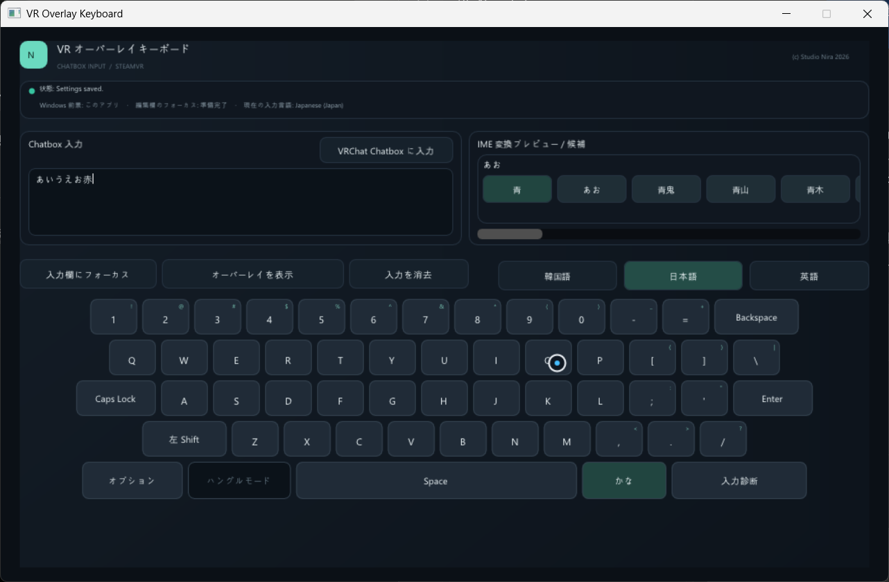
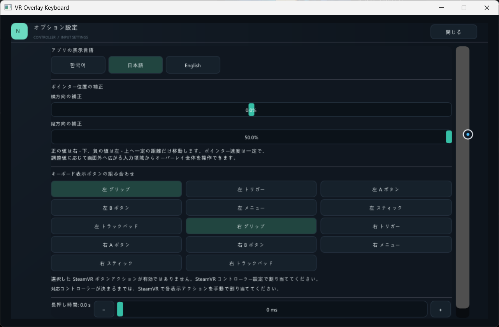

# VR Overlay Keyboard

[English](README.md) · [日本語] · [한국어](README.ko.md)

VR Overlay Keyboardは、SteamVRオーバーレイ上のキーボードを使って、VRChatのChatboxに文章を入力するWindowsアプリです。

> **動作確認済みの機器:** 実機での使用を確認しているVR機器は、現在Meta Quest 3のみです。そのほかのヘッドセットやコントローラーの組み合わせは未確認です。

## ダウンロード

[GitHub Releasesページ](https://github.com/prunusnira/vr-overlay-keyboard/releases)からダウンロードできます。

## 起動前の準備

- Windows 10または11、Steam、SteamVRが必要です。
- ヘッドセットをSteamVRに接続してください。動作確認済みのヘッドセットはMeta Quest 3のみです。
- VRChatのChatboxへ文章を送るには、VRChatでOSCを有効にしてください。
- 使用するWindowsの入力言語とキーボード/IMEを追加してください。
  - Windows 11: **設定 > 時刻と言語 > 言語と地域 > 言語の追加**を開きます。
  - Windows 10: **設定 > 時刻と言語 > 言語 > 言語の追加**を開きます。
  - 追加後、対象言語の**言語のオプション**でキーボード/IMEがインストールされていることを確認してください。詳しくは[MicrosoftのWindows言語・キーボード設定ガイド](https://support.microsoft.com/en-US/Windows/Hardware/Input-Devices/manage-the-language-and-keyboard-input-layout-settings-in-windows)をご覧ください。
- アプリが起動しない場合は、[Microsoft Visual C++ 再頒布可能パッケージ (x64)](https://aka.ms/vc14/vc_redist.x64.exe)をインストールしてください。

## 基本的な使い方

1. SteamVRを起動してから、VR Overlay Keyboardを起動します。デスクトップウィンドウが開き、VRオーバーレイは最初は非表示です。
2. **左右のグリップボタン**を同時に押すとキーボードが表示されます。
   - これが初期設定です。表示ボタンの組み合わせは**オプション**で変更できます。
3. コントローラーをオーバーレイに向けて入力欄を選択し、英語・韓国語・日本語を選んで、バーチャルキーで入力します。
4. VRChatでOSCを有効にし、**VRChat Chatbox に入力**を選択して文章を送信します。
5. オーバーレイを移動するには、オーバーレイに向けて**グリップ**を押しながらコントローラーを動かします。グリップを押したまま同じコントローラーのスティックを操作すると、オーバーレイの大きさと距離を調整できます。

アプリのキーボードウィンドウにWindowsのフォーカスがない場合、日本語はひらがなでのみ入力され、漢字変換はできません。漢字変換を使うには、**入力欄にフォーカス**でアプリのウィンドウにWindowsのフォーカスを移してください。

## オプション

キーボードウィンドウの**オプション**を選ぶと、次の項目を設定できます。

- アプリの表示言語（英語・韓国語・日本語）
- 両方のコントローラーに適用するポインターの横・縦位置補正（-50%～+50%）
- オーバーレイを表示するコントローラーボタンの組み合わせと長押し時間（0～3秒）。初期設定は**左グリップ + 右グリップ**、長押し時間は0秒です。

オプションはこのPCに自動保存されます。

## お問い合わせ

質問やサポートについては[GitHub Discussions](https://github.com/prunusnira/vr-overlay-keyboard/discussions)をご利用ください。
