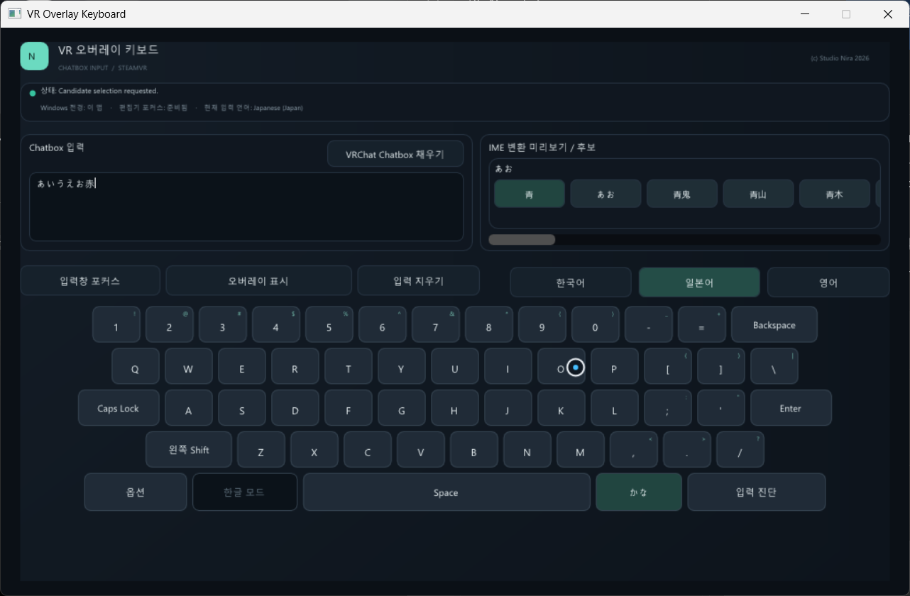
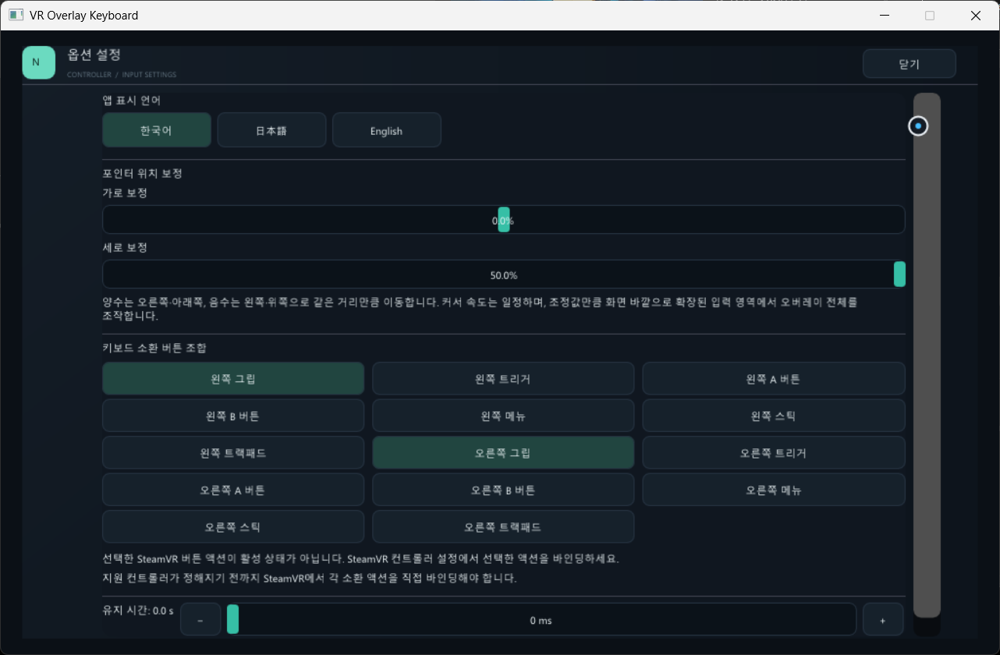

# VR Overlay Keyboard

[English](README.md) · [日本語](README.ja.md) · [한국어]

VR Overlay Keyboard는 SteamVR 오버레이 키보드로 VRChat Chatbox에 문장을 입력하는 Windows 앱입니다.

> **사용 확인 기기:** 현재 실제 사용을 확인한 VR 기기는 Meta Quest 3뿐입니다. 다른 헤드셋과 컨트롤러 조합은 아직 확인되지 않았습니다.

## 다운로드

[GitHub Releases 페이지](https://github.com/prunusnira/vr-overlay-keyboard/releases)에서 받을 수 있습니다.

## 시작하기 전에

- Windows 10 또는 11과 Steam, SteamVR이 필요합니다.
- 헤드셋을 SteamVR에 연결해야 합니다. 현재 사용 확인된 기기는 Meta Quest 3뿐입니다.
- VRChat에서 Chatbox로 텍스트를 보내려면 OSC를 켜야 합니다.
- 사용할 Windows 입력 언어와 키보드/IME를 추가하세요.
  - Windows 11: **설정 > 시간 및 언어 > 언어 및 지역 > 언어 추가**를 엽니다
  - Windows 10: **설정 > 시간 및 언어 > 언어 > 언어 추가**를 엽니다
  - 추가한 뒤 해당 언어의 **언어 옵션**에서 키보드/IME가 설치되어 있는지 확인하세요. 자세한 내용은 [Microsoft Windows 언어 및 키보드 안내](https://support.microsoft.com/en-US/Windows/Hardware/Input-Devices/manage-the-language-and-keyboard-input-layout-settings-in-windows)를 참고하세요.
- 앱이 실행되지 않으면 [Microsoft Visual C++ Redistributable (x64)](https://aka.ms/vc14/vc_redist.x64.exe)를 설치하세요.

## 기본 사용법

1. SteamVR을 실행한 다음 VR Overlay Keyboard를 실행합니다. 데스크톱 창이 열리고 VR 오버레이는 처음에 숨겨져 있습니다.
2. **양쪽 그립버튼**을 동시에 눌러 키보드를 화면상에 소환할 수 있습니다.
   - 기본 옵션으로, 키보드 소환 조건은 옵션에서 수정할 수 있습니다
3. 컨트롤러로 오버레이를 가리켜 입력란을 선택하고, 영어·한국어·일본어를 선택한 뒤 가상 키를 눌러 입력합니다.
4. VRChat에서 OSC를 켠 다음 **VRChat Chatbox 채우기**를 선택해 문장을 전송합니다.
5. 오버레이를 옮기려면 오버레이를 가리킨 채 **그립**을 누르고 컨트롤러를 움직입니다. 그립을 누른 상태에서 같은 컨트롤러의 조이스틱으로 크기와 거리를 조정할 수 있습니다.

앱 키보드 창에 Windows 포커스가 없으면 일본어는 히라가나로만 입력되며 한자 변환은 할 수 없습니다. 한자 변환을 하려면 **입력창 포커스**로 앱 창에 Windows 포커스를 주세요.

## 옵션

키보드 창에서 **옵션**을 선택하면 다음 항목을 설정할 수 있습니다.

- 앱 화면 언어(영어·한국어·일본어)
- 양쪽 컨트롤러에 적용되는 포인터 가로·세로 보정값(-50%~+50%)
- 오버레이를 표시하는 컨트롤러 버튼 조합과 누르고 있어야 하는 시간(0~3초). 기본 조합은 **왼쪽 그립 + 오른쪽 그립**이며 대기 시간은 0초입니다.

옵션은 이 PC에 자동 저장됩니다.

## 문의

문의나 도움이 필요하면 [GitHub Discussions](https://github.com/prunusnira/vr-overlay-keyboard/discussions)를 이용해 주세요.
