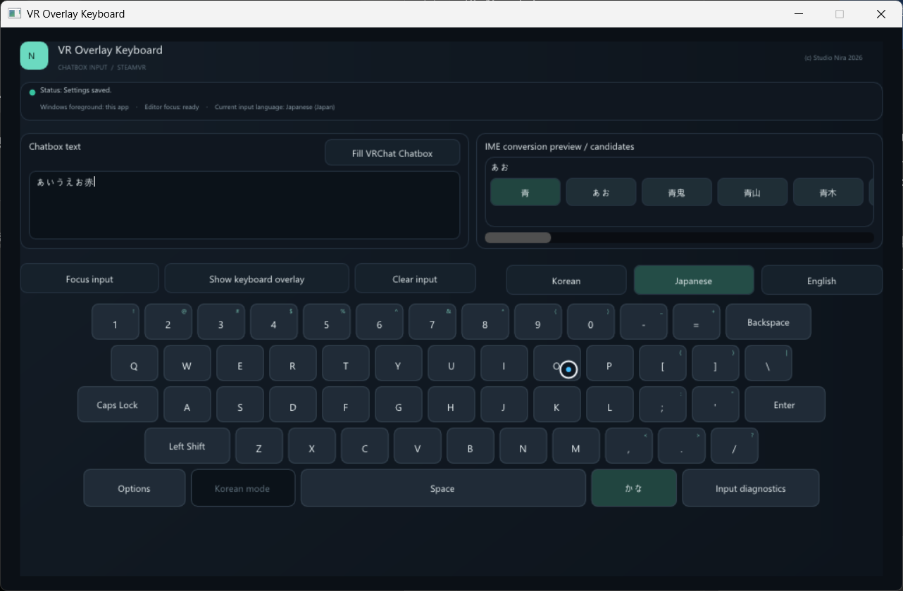
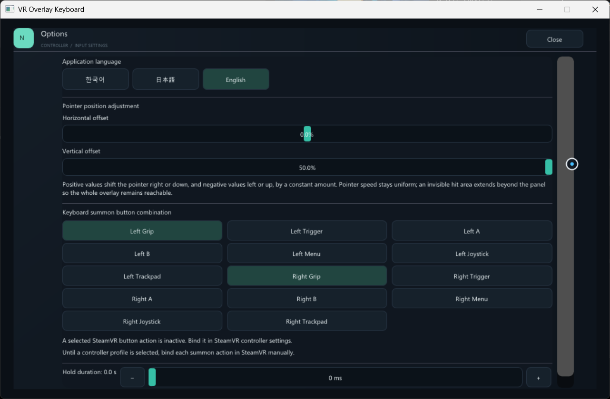

# VR Overlay Keyboard

[English] · [日本語](README.ja.md) · [한국어](README.ko.md)

VR Overlay Keyboard is a Windows app that lets you type messages into the VRChat Chatbox with a keyboard shown as a SteamVR overlay.

> **Verified hardware:** The app has only been verified in use with Meta Quest 3. Other headsets and controller combinations have not been verified.

## Download

Download it from the [GitHub Releases page](https://github.com/prunusnira/vr-overlay-keyboard/releases).

## Before you start

- Windows 10 or 11, with Steam and SteamVR installed and running.
- A headset connected to SteamVR. Meta Quest 3 is the only headset verified so far.
- OSC enabled in VRChat to send text to the Chatbox.
- Add the Windows input language and keyboard/IME you want to use.
  - Windows 11: open **Settings > Time & language > Language & region > Add a language**.
  - Windows 10: open **Settings > Time & language > Language > Add a language**.
  - After adding it, open that language's **Language options** to check that the keyboard/IME is installed. See [Microsoft's Windows language and keyboard guide](https://support.microsoft.com/en-US/Windows/Hardware/Input-Devices/manage-the-language-and-keyboard-input-layout-settings-in-windows).
- If the app does not start, install the [Microsoft Visual C++ Redistributable (x64)](https://aka.ms/vc14/vc_redist.x64.exe).

## Basic use

1. Start SteamVR, then launch VR Overlay Keyboard. The desktop window opens and the VR overlay starts hidden.
2. Press both **Grip buttons** at the same time to summon the keyboard.
   - This is the default. You can change the summon combination in **Options**.
3. Point a controller at the overlay, select the text field, choose English, Korean, or Japanese, and enter text with the virtual keys.
4. Enable OSC in VRChat, then select **Fill VRChat Chatbox** to send the text.
5. To move the overlay, point at it and hold **Grip** while moving your controller. While holding Grip, use that controller's thumbstick to adjust the overlay size and distance.

When the app does not have Windows keyboard focus, Japanese input is composed as Hiragana and Kanji conversion is unavailable. To use Kanji conversion, give the app keyboard window Windows focus with **Focus input**.

## Options

Select **Options** in the keyboard window to:

- Change the app display language between English, Korean, and Japanese.
- Adjust horizontal and vertical pointer offsets from -50% to +50%. The offsets apply to both controllers.
- Choose the controller buttons that show the overlay and set how long they must be held (0 to 3 seconds). The default combination is **Left Grip + Right Grip** with no hold delay.

Options are saved automatically on this PC.

## Contact

For questions or help, visit [GitHub Discussions](https://github.com/prunusnira/vr-overlay-keyboard/discussions).
