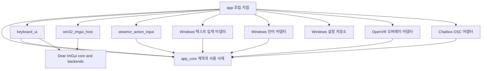

# 모듈 아키텍처와 오버레이 실행 흐름

상태: `app/`에 Dear ImGui 기반 Windows 앱을 구현했고 Windows x64 Release 빌드를 확인했다. UI는 Win32 platform backend와 OpenGL3 renderer를 사용하고, Win32/OpenGL host가 만든 RGBA 프레임을 OpenVR 어댑터의 지속 OpenGL 텍스처로 전달한다. 앱 UI 언어, 사용자 설정 저장, SteamVR 컨트롤러 소환 조합과 옵션 창을 추가했다. Windows IME·SteamVR HMD 동작은 별도 확인이 필요하다. `prototype/windows-ime-overlay` 코드는 수정하거나 제품 앱으로 옮기지 않는다. 프로토타입에서 확인된 사용자 흐름은 제품 앱의 동작 기준으로 삼는다.

## 목표

SteamVR 대시보드를 열지 않고 VR 사용 중 정해둔 커맨드로 키보드 오버레이를 표시하고 숨긴다. 컨트롤러로 오버레이를 조작하고, 선택한 Windows 입력기로 문장을 작성해 VRChat Chatbox 입력란에 채운다.

## 프로토타입과 제품 앱 관계

제품 앱은 `app/`의 독립 CMake 프로젝트이며 UI와 렌더링은 Dear ImGui, Win32, OpenGL3로 구현한다. 프로토타입 코드를 이동·리팩터링하거나 제품 앱의 소스로 직접 편입하지 않는다. 프로토타입에서 확인한 대시보드 안의 컨트롤러 포인터 입력, 입력 언어 전환, 일본어 모드 전환, VRChat Chatbox OSC 흐름을 제품 앱에 새 모듈 경계와 일반 오버레이 사용 방식으로 다시 구성했다. 기존 동작이 확인됐다는 사실은 대시보드 없는 토글이나 미검증 IME 동작까지 확인됐다는 뜻은 아니다.

기존 오버레이 토글은 SteamVR Input의 `ToggleKeyboard` 디지털 액션으로 받는다. 별도로 좌우 Grip·Trigger·A·B·Menu·Joystick·Trackpad 액션을 읽으며, 옵션의 기본 소환 조합은 `RightGrip + RightB`, 유지시간은 `0ms`다. 소환 조합은 숨겨진 오버레이를 표시하고, 버튼을 놓기 전에는 다시 발화하지 않는다. 컨트롤러를 확정하기 전까지 물리 입력 기본 바인딩은 제공하지 않으며 사용자는 SteamVR 입력 설정에서 토글·포인터·선택한 소환 버튼을 연결해야 한다. 전역 단축키나 외부 프로세스 명령은 같은 앱 커맨드를 호출하는 추가 입력 어댑터로 나중에 붙일 수 있다. [Valve SteamVR Input 문서](https://github.com/ValveSoftware/openvr/wiki/SteamVR-Input)

## VR에서 바로 표시하기

현재 프로토타입은 `CreateDashboardOverlay`로 대시보드 탭을 만들고 `ShowDashboard`를 호출한다. `ShowDashboard`는 지정한 탭이 보이도록 VR 대시보드를 표시하는 API다. 따라서 현재 구현은 SteamVR 메뉴를 여는 동작과 연결돼 있다. [프로토타입 오버레이 구현](../prototype/windows-ime-overlay/src/overlay/openvr_overlay.cpp), [Valve `ShowDashboard` 설명](https://github.com/ValveSoftware/openvr/wiki/IVROverlay%3A%3AShowDashboard)

제품 경로에서는 일반 오버레이를 만들고, 첫 표시 때 HMD의 현재 포즈로부터 앞쪽 위치를 계산해 `TrackingUniverseStanding` 절대 좌표에 둔다. 이후 위치는 방 안에 고정하되, 매 입력 갱신에서 회전만 HMD를 향하게 계산해 화면 정면이 사용자를 바라보도록 한다. 숨겼다가 다시 표시해도 마지막 위치를 보존한다. 선택한 손의 SteamVR 포인터 자세와 클릭을 받고 `IVROverlay::ComputeOverlayIntersection`으로 광선과 오버레이의 교차 UV를 UI 포인터 이벤트로 바꾼다. 옵션의 가로·세로 보정값을 오버레이 크기 대비 퍼센트로 UV 좌표에 적용해 커서 표시와 클릭 위치를 함께 조정한다. 기본 세로 보정은 +2.4%이며, 각 축은 -10%에서 +10%까지 바꿀 수 있다. 오버레이를 가리킨 상태에서 해당 손의 Grip을 누르면 시작 시점의 컨트롤러-오버레이 간격을 보존하며 컨트롤러를 따라 이동하고, Grip을 놓으면 절대 좌표에 고정된다. Grip을 누른 채 스틱을 좌우로 기울이면 오버레이 폭을 바꾸고, 위아래로 기울이면 컨트롤러 앞쪽 거리를 조정한다. [Valve 오버레이 개요](https://github.com/ValveSoftware/openvr/wiki/IVROverlay_Overview), [일반 오버레이 생성](https://github.com/ValveSoftware/openvr/wiki/IVROverlay%3A%3ACreateOverlay), [절대 추적 좌표 위치](https://github.com/ValveSoftware/openvr/wiki/IVROverlay%3A%3ASetOverlayTransformAbsolute), [광선 교차 계산](https://github.com/ValveSoftware/openvr/wiki/IVROverlay%3A%3AComputeOverlayIntersection), [SteamVR Input 액션](https://github.com/ValveSoftware/openvr/wiki/Action-manifest), [현재 Valve OpenVR 헤더](https://github.com/ValveSoftware/openvr/blob/master/headers/openvr.h)

권장 표시 흐름은 다음과 같다.

1. 앱이 SteamVR에 연결되면 일반 오버레이를 생성하고 시작 상태를 숨김으로 둔다.
2. SteamVR Input의 토글·포인터·좌우 스틱·좌우 소환 버튼 액션을 계속 확인한다. Meta Quest Touch는 기본 포인터 자세·트리거 클릭·양손 Grip·스틱 바인딩을 제공하며, 옵션에서 포인터 손을 고른다.
3. 기존 `ToggleKeyboard`는 표시와 숨김을 전환한다. 설정한 소환 버튼 조합은 모든 버튼을 동시에 누른 뒤 설정한 홀드 시간이 지나면 숨겨진 키보드를 표시하며, 0초는 첫 동시 입력 갱신에서 발화한다.
4. 첫 표시 위치를 HMD 기준으로 계산한 뒤 standing 추적 좌표의 월드 위치로 고정하고, 회전은 사용자를 향하게 계속 갱신한다. 선택한 손의 컨트롤러 광선과 트리거로 포인터 선택을 하고, 포인터가 보이도록 커서를 텍스처에 그린다. 오버레이를 가리키고 Grip을 잡아 이동하는 동안 스틱 좌우로 크기를, 위아래로 거리를 조절한다. Grip을 놓으면 그 위치와 크기에 고정한다. 키보드 화면의 숨김 버튼은 오버레이만 감춘다.

manifest는 Meta Quest Touch(`oculus_touch`)용 기본 포인터 자세·트리거 클릭·그립 바인딩을 포함한다. Quest의 기본 소환 조합은 오른쪽 Grip+B에 연결된다. ToggleKeyboard는 사용자가 기존 SteamVR 바인딩을 유지할 수 있도록 기본 프로필에 강제하지 않는다. 다른 컨트롤러 유형은 각 액션을 SteamVR 입력 설정에서 연결해야 한다. 옵션 창은 키보드와 같은 ImGui 프레임에 그리므로 데스크톱과 단일 OpenVR 오버레이 이미지에 함께 표시된다. 일반 사용 흐름에서 키보드를 열고 닫을 때마다 대시보드를 열 필요는 없다. 제품 앱의 소환 조합, 공간 고정과 사용자 방향 회전, Grip 이동, 일반 오버레이 포인터 조작과 토글 액션 수신은 HMD에서 확인해야 한다.

## 모듈 구성

| 모듈 | 책임 | 의존하지 않을 대상 |
| --- | --- | --- |
| `app_core` | 오버레이 표시·숨김, 설정 적용·저장, 사용자 상태와 `ControllerSummonTrigger`의 동시 누름·홀드 판정을 조정한다. | UI 프레임워크, OpenVR, Win32, OSC 구현 |
| `steamvr_action_input` | SteamVR Input 토글·포인터·스틱 액션과 좌우 14개 논리 버튼 액션을 앱 커맨드 및 컨트롤러 포인터·버튼 샘플로 바꾼다. | 오버레이 렌더링, IME 구현 |
| `keyboard_ui` | Dear ImGui로 입력란, 키, 후보, 입력 언어, 현지화된 앱 UI와 옵션 창을 그린다. 후보 영역은 고정 높이의 가로 스크롤로 유지한다. 사용자 동작을 앱 계약으로 내보내고 오버레이 포인터 입력을 ImGuiIO 이벤트로 받는다. | TSF, Win32, OpenVR, UDP 구현 |
| `ui/settings_ui` | 언어·포인터 가로/세로 보정·소환 버튼 조합·유지시간을 편집하는 별도 ImGui 창을 그린다. 키보드와 같은 입력 세션을 사용해 편집 포커스를 보존하고 같은 렌더 프레임에 포함한다. | Windows 설정 파일, SteamVR, OpenVR |
| `ui/imgui_input_session` | 편집창과 가상 버튼의 포인터 이벤트를 분리하고, 같은 버튼에서 뗐을 때 한 번 동작을 실행한다. 후보 스크롤도 편집창 포커스를 유지한다. `keyboard_ui` 타깃 안의 별도 UI 모듈이다. | Windows 전경 전환, SendInput, TSF 구현 |
| `platform/windows/ime_composition` | IMM 메시지의 조합 문자열과 확정 문자열을 분리한다. 조합 문자열은 앱 snapshot으로 내보내고 확정 문자열만 편집 입력 큐에 전달한다. `win32_imgui_host` 타깃 안의 별도 Windows 모듈이다. | ImGui 위젯, TSF 후보 선택, OSC |
| `platform/windows/virtual_mouse_router` | 앱 UI 스레드에 한정된 마우스 훅으로 한국어 가상 버튼 클릭을 공용 포인터 이벤트로 전환한다. 편집창 선택은 일반 입력으로 남기고, 창 밖에서 놓친 뗌/앱 비활성화는 취소한다. | ImGui 위젯, IME 문자열 조합 규칙, OpenVR |
| `text_input` | 입력 세션, 가상 키 요청, 조합 및 후보 상태를 표현한다. 실제 입력 수단은 어댑터 뒤에 둔다. | 오버레이, OSC |
| `windows_tsf_input` | TSF UI-less 후보 정보와 후보 선택 동작을 처리한다. Windows 키 전달 경로도 별도 어댑터로 감싼다. | UI, OpenVR |
| `windows_language` | Windows에서 사용 가능한 입력 언어를 조회하고 선택된 입력 언어를 활성화한다. | 키보드 UI |
| `openvr_overlay` | 일반 오버레이의 생성·종료, standing 공간 고정 위치와 HMD 방향 회전, Grip 드래그 중 크기·거리 조정, 표시 상태, 이미지 전달과 설정 가능한 가로·세로 보정 컨트롤러 포인터 입력을 처리한다. | 언어, TSF, Chatbox |
| `chatbox_osc` | Chatbox 목적 주소와 OSC 패킷을 처리해 문장을 전송한다. | 키보드 UI, OpenVR |
| `settings_and_diagnostics` | 사용자 설정과 진단 로그를 관리한다. 초기 버전은 작은 구성 요소로 시작해도 된다. | 특정 화면 구성 |
| `platform/windows/settings_store` | `%LOCALAPPDATA%`의 설정 파일을 읽고 원자적으로 저장한다. UI 언어, 포인터 보정값, 컨트롤러 버튼 조합, 0~3000ms 유지 시간을 검증한다. | ImGui, OpenVR |
| `dear_imgui` | 고정한 Dear ImGui 버전과 Win32/OpenGL3 공식 backend를 정적 타깃으로 제공한다. | 앱의 OpenVR·IME 서비스 |
| `win32_imgui_host` | Win32 창, WGL 컨텍스트, backend 수명, 프레임 렌더링과 RGBA readback을 관리한다. | 앱 커맨드, TSF, OSC |

현재 CMake는 위 책임 중 구현된 항목을 정적 라이브러리 타깃으로 나누고 `vr-overlay-keyboard` 실행 파일에서 조립한다. Windows 설정 저장 어댑터는 플랫폼 경계로 분리하고, 검증과 홀드 판정은 앱 코어에 둔다. 별도 프로세스나 플러그인 구조는 필요가 확인된 뒤 결정한다.

### 컴파일 의존성

화살표는 컴파일 시 참조 방향을 나타낸다. UI와 어댑터는 `app_core` 계약에 의존하고, `app` 조립 지점이 Dear ImGui host와 Windows·OpenVR·OSC 구현을 연결한다. `app_core`는 UI 프레임워크나 구현 모듈을 참조하지 않는다. UI와 어댑터 사이에는 `HWND`, `HKL`, TSF 인터페이스, OpenVR 핸들과 같은 플랫폼 타입을 노출하지 않는다. OpenVR 포인터 이벤트는 앱 계약으로 변환하고, `keyboard_ui`가 이를 ImGuiIO 이벤트로 전달한다.

실행 중에는 커맨드 입력 어댑터가 `ToggleKeyboard`를 앱 코어에 전달하고, 코어가 OpenVR 표시 포트를 호출한다. OpenVR 어댑터가 컨트롤러 포인터 이벤트를 앱 내부 이벤트로 바꿔 UI에 전달한다. UI 동작은 앱 코어 커맨드로 돌아오며, 텍스트 입력·언어·OSC 어댑터는 코어가 정한 계약을 수행한다. UI가 만든 프레임은 앱 조립 지점에서 OpenVR 표시 포트로 전달한다. 이 이벤트 흐름은 모듈 간 컴파일 의존성의 방향과 구분한다.

데스크톱 화면은 매 프레임 렌더링한다. OpenGL 픽셀 readback은 오버레이가 표시 중일 때만 수행하고 약 30Hz로 제한해 숨겨진 동안의 불필요한 동기화 비용을 줄인다. 이 갱신률의 HMD 체감과 GPU별 readback 비용은 실기기에서 판정한다.

Win32 backend가 마우스 위치를 갱신한 뒤, `ImGui::NewFrame` 전에 SteamVR 액션을 읽어 VR 포인터 좌표를 입력 큐에 넣는다. 전체 화면 메인 창은 `NoBringToFrontOnFocus`, 옵션 창은 `NoFocusOnAppearing`을 사용해 편집창 자동 포커스와 옵션 표시 순서가 충돌하지 않게 한다. 포인터 보정 슬라이더는 가상 버튼과 동일하게 ActiveId를 변경하지 않는다. Grip 이동은 패널 교차 판정을 유지하면서 트리거 캡처보다 먼저 처리한다. 소환 Grip은 해제까지 차단하고, 이동 중에는 앱이 보관한 월드 행렬에 사용자 방향 회전을 합쳐 한 번 제출한다. Grip 바인딩·눌림 상태와 이동 시작·종료·실패를 진단에 표시한다. 해당 수정의 HMD 실측은 아직 필요하다.

현재 Dear ImGui 확정 문자열은 `KeyboardUi`가 보유한다. `WindowsImeComposition`은 Win32 host가 받는 `WM_IME_STARTCOMPOSITION`, `WM_IME_COMPOSITION`, `WM_IME_ENDCOMPOSITION`을 backend보다 먼저 한 번 처리한다. `GCS_COMPSTR`은 고정 미리보기 영역의 조합 snapshot으로 게시하고, `GCS_RESULTSTR`만 ImGui 문자 입력 큐로 넘긴다. 기본 IME 조합 창은 숨기고, TSF 후보 sink는 기존 후보 수집·선택을 담당한다. 조합 중 편집 키는 확정 편집 버퍼에 중복 적용하지 않는다. Clear는 조합을 취소하며, OSC 전송은 조합 확정 후 편집 버퍼에 결과가 반영될 때 실행한다. [Microsoft 조합 메시지 설명](https://learn.microsoft.com/en-us/windows/win32/intl/wm-ime-composition), [조합 창 표시 제어](https://learn.microsoft.com/en-us/windows/win32/intl/wm-ime-setcontext)

TSF 문서 저장소를 앱이 직접 소유하는 구조는 아직 구현하지 않았다. 현대 Windows IME의 IMM 호환 경로와 현재 TSF 후보 sink가 함께 동작하는지는 설치된 입력기에서 검증해야 한다.

2026-10-01 사용자 실측에서 데스크톱 일본어 입력·변환은 정상으로 확인했지만, 한국어는 포커스 표시가 유지된 상태에서도 마우스 클릭마다 자모가 확정되었다. 한국어 레이아웃에서는 `WindowsVirtualMouseRouter`가 등록된 가상 버튼/스크롤바 영역의 클릭을 `WH_MOUSE` 단계에서 소비하고 컨트롤러와 같은 포인터 콜백으로 넘긴다. 새 입력기 훅보다 먼저 처리하기 위해 언어 전환과 조합 시작 때만 훅 순서를 갱신한다. 편집창 내부 클릭, 일본어·영어 입력, 다른 앱의 마우스 입력은 이 변환 대상이 아니다. 새 한국어 경로의 실제 조합은 아직 확인되지 않았다. [Microsoft MouseProc](https://learn.microsoft.com/en-us/windows/win32/winmsg/mouseproc), [훅 설치 범위와 순서](https://learn.microsoft.com/en-us/windows/win32/api/winuser/nf-winuser-setwindowshookexw)

포인터 입력은 프로토타입의 버튼 event filter와 같은 순서로 처리한다. `ImGuiInputSession`은 편집창 바깥에서 시작한 누름·드래그·뗌을 편집기에 전달하지 않고, 가상 버튼은 같은 버튼 안에서 뗀 경우에만 동작을 실행한다. Dear ImGui 입력창 자체의 바깥 클릭 해제를 막아 조합 중 편집창의 활성 상태와 선택을 유지한다. 편집창에서 시작한 선택 드래그는 그대로 전달한다. 앱이 전경으로 시작하거나 다시 활성화되면 입력창 포커스를 자동으로 유지하고, 이미 활성인 편집창은 재초기화하지 않는다. Win32 host도 활성화 시 OS 포커스가 없을 때만 같은 창에 복원한다. Windows 전경 상태는 매 프레임 표시하고 실제 키 전송 직전에 Windows 어댑터에서 다시 확인한다. 이 흐름의 포커스·클릭·일본어 확정 문자열 백스페이스·후보 가로 스크롤은 headless ImGui 회귀 테스트로 확인하며, Windows IME 조합과 TSF 후보 확정은 별도 실행 검증이 필요하다.

## 프로토타입에서 참고할 책임과 동작

아래 항목은 기존 코드를 옮기라는 지시가 아니다. 코드의 결합 구조는 현재 제품 앱에서 피할 설계 사례로 읽고, 확인된 사용자 흐름은 제품 앱이 이어받을 동작 기준으로 사용한다.

- `main.cpp`가 앱 생성, TSF 초기화, OSC 연결, OpenVR 초기화, 콜백 연결, 폴링과 종료를 모두 맡는다. 제품 앱의 진입점은 조립 지점으로 제한하고 모듈 구현은 앱 계약에 맞춘다. [프로토타입 진입점](../prototype/windows-ime-overlay/src/main.cpp)
- `OpenVrOverlay`가 OpenVR 런타임 수명, 대시보드 표시, 텍스처 전달과 포인터 이벤트 변환을 한 클래스에서 처리한다. 일반 오버레이 표시 상태와 포인터 입력 처리는 이 모듈 안에서 역할을 나눌 수 있다. [프로토타입 오버레이 클래스](../prototype/windows-ime-overlay/src/overlay/openvr_overlay.cpp)
- `KeyboardWidget`가 화면 표시 외에 Windows 입력 언어 조회·전환, TSF 후보 데이터, 키 전달, 오버레이 표시와 OSC 전송 콜백을 안다. UI는 화면과 사용자 동작 전달에 집중시킨다. [프로토타입 UI 인터페이스](../prototype/windows-ime-overlay/src/ui/keyboard_widget.h), [UI의 Windows 언어 처리](../prototype/windows-ime-overlay/src/ui/keyboard_widget.cpp)
- `TsfInput::sendVirtualKey`는 TSF 문서 저장소에 직접 입력하는 대신 Windows `SendInput`을 사용하고, 앱이 전경 프로세스인지 확인한다. 따라서 이 키 전달 경로는 TSF 후보 목록 수집과 별도 경계로 취급한다. [프로토타입 키 입력 구현](../prototype/windows-ime-overlay/src/ime/tsf_input.cpp)
- `OscClient`가 Chatbox 주소, 144자 검사, OSC 패킷 생성, Winsock 송신을 묶고 기본 포트 `9000`을 코드에 둔다. 초기에는 `chatbox_osc` 한 모듈로 묶어도 되지만, 목적지 설정과 전송은 UI에서 분리한다. [프로토타입 OSC 구현](../prototype/windows-ime-overlay/src/osc/osc_client.cpp)

## 확인된 점과 미확인 점

### 코드와 기록에서 확인한 점

- 현재 대시보드 메뉴 의존은 `CreateDashboardOverlay`와 `ShowDashboard` 호출에서 온다.
- 사용자는 프로토타입에서 컨트롤러로 대시보드 오버레이를 조작하고, 입력 언어 표시 변경과 일본어 모드 전환을 확인했다.
- OSC 전송에서 `/chatbox/input`에 `send=false`를 사용하고, 사용자는 프로토타입 문장이 VRChat Chatbox에 도착하는 것을 확인했다.
- 현재 가상 키 전송 코드에는 앱의 Windows 전경 상태 검사가 있다.

### 추가 검증이 필요한 점

- SteamVR Input 액션으로 앱이 실행 중인 동안 대시보드 없이 오버레이를 토글할 수 있는지, 대상 컨트롤러에 필요한 기본 바인딩이 무엇인지는 제품 앱에서 확인한다.
- 대시보드 오버레이에서 확인된 포인터 조작 흐름을 제품 앱의 SteamVR Input 자세·클릭 액션과 `ComputeOverlayIntersection` 경로로 연결하고, 게임 화면 입력의 상호작용을 확인한다.
- 게임 중 오버레이 조작이 현재 `SendInput`과 Dear ImGui 데스크톱 창의 Windows 입력 포커스 조건을 만족하는지는 확정되지 않았다. 현재 구현은 앱이 전경 창일 때만 가상 키를 보내므로 게임 포커스와 함께 쓸 수 있는지 실기기에서 판정해야 한다.
- 사용자가 기록한 한국어 가상 키 입력은 자모별 커밋이 있었고 TSF 후보 sink를 끈 상태에서도 동일했다. 그러므로 후보 sink가 원인이라고 볼 근거는 없다. 입력 경로의 정확한 원인은 아직 확인되지 않았다.
- 프로토타입에서 일본어 모드 전환은 확인됐지만, TSF 후보 UI-less 지원과 후보 확정은 입력기별 확인이 필요하다. 중국어 입력과 다국어 OSC 왕복도 현재 실행 기록만으로 통과 처리할 수 없다. [기술 조사](TECHNICAL_FEASIBILITY.md), [프로토타입 실행 기록](../prototype/windows-ime-overlay/README.md)

## 권장 구현 순서

1. **Windows 빌드:** Dear ImGui FetchContent, Win32/OpenGL3 backend와 OpenVR SDK를 사용한 Release 빌드는 통과했다. 다른 Windows 환경에서도 실행 파일과 OpenVR runtime DLL 배치를 확인한다.
2. **데스크톱과 VR 표시:** Win32 창의 ImGui 화면과 OpenGL readback 프레임이 일반 OpenVR 오버레이에 동일하게 표시되는지 대시보드가 닫힌 상태에서 확인한다.
3. **컨트롤러 상호작용:** 구현된 SteamVR Input 자세·클릭 액션과 `ComputeOverlayIntersection` 경로를 HMD에서 확인한다. 대상 컨트롤러 바인딩과 게임 화면 입력 영향도 확인한다.
4. **텍스트 입력 경로:** VR 중 편집기 포커스, 한글 조합, 일본어 후보 수신·확정이 가능한지 실기기에서 판정한다. 이 결과에 맞춰 ImGui 편집 문자열과 TSF 상태의 책임을 조정한다.
5. **기존 흐름 확인:** 입력 언어 표시·변경, 일본어 모드 전환, Chatbox OSC 입력을 프로토타입에서 확인한 기준으로 확인한다.
6. **VRChat 연결과 설정:** 제품 앱에서 다국어 OSC 왕복을 확인하고, 언어·바인딩 등 사용자 설정을 저장할 범위를 정한다.

기존 기획과 상세한 기술 판정 항목은 [프로젝트 기획](PROJECT_PLAN.md)과 [기술 조사](TECHNICAL_FEASIBILITY.md)를 참고한다.
