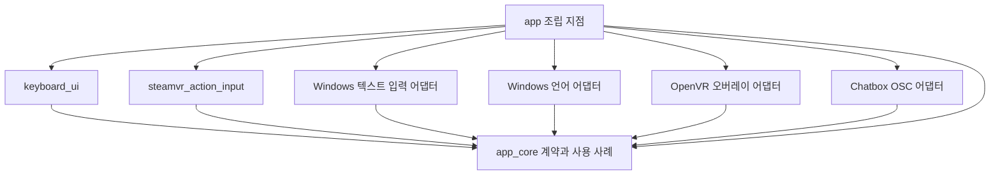

# 모듈 아키텍처와 오버레이 실행 흐름

상태: 신규 `app/` 프로젝트 구현 중. `prototype/windows-ime-overlay` 코드는 수정하거나 제품 앱으로 옮기지 않는다. 프로토타입에서 확인된 사용자 흐름은 새 앱이 이어받을 동작 기준이며, 구현은 새 모듈 경계에 맞춰 다시 작성한다. 대시보드 없는 오버레이, 입력기별 동작과 실제 HMD 조작은 새 앱에서 확인한다.

## 목표

SteamVR 대시보드를 열지 않고 VR 사용 중 정해둔 커맨드로 키보드 오버레이를 표시하고 숨긴다. 컨트롤러로 오버레이를 조작하고, 선택한 Windows 입력기로 문장을 작성해 VRChat Chatbox 입력란에 채운다.

## 프로토타입과 새 프로젝트 관계

제품 구현은 `app/`의 독립 CMake 프로젝트에서 새로 시작한다. 프로토타입 코드를 이동·리팩터링하거나 제품 앱의 소스로 직접 편입하지 않는다. 대신 프로토타입에서 확인한 대시보드 안의 컨트롤러 포인터 입력, 입력 언어 전환, 일본어 모드 전환, VRChat Chatbox OSC 입력 흐름을 새 앱의 요구사항과 회귀 확인 기준으로 삼는다. 이 흐름을 새 모듈 경계와 일반 오버레이 사용 방식에 맞춰 구현한다. 기존 흐름이 확인됐다는 사실은 대시보드 없는 토글이나 미검증 IME 동작까지 확인됐다는 뜻은 아니다.

오버레이 토글은 SteamVR Input의 `ToggleKeyboard` 디지털 액션으로 받는다. 컨트롤러를 확정하기 전까지 기본 바인딩은 제공하지 않으며, 사용자는 SteamVR 입력 설정에서 토글·포인터 자세·클릭 액션을 바인딩해야 한다. 전역 단축키나 외부 프로세스 명령은 같은 앱 커맨드를 호출하는 추가 입력 어댑터로 나중에 붙일 수 있다. [Valve SteamVR Input 문서](https://github.com/ValveSoftware/openvr/wiki/SteamVR-Input)

## VR에서 바로 표시하기

현재 프로토타입은 `CreateDashboardOverlay`로 대시보드 탭을 만들고 `ShowDashboard`를 호출한다. `ShowDashboard`는 지정한 탭이 보이도록 VR 대시보드를 표시하는 API다. 따라서 현재 구현은 SteamVR 메뉴를 여는 동작과 연결돼 있다. [프로토타입 오버레이 구현](../prototype/windows-ime-overlay/src/overlay/openvr_overlay.cpp), [Valve `ShowDashboard` 설명](https://github.com/ValveSoftware/openvr/wiki/IVROverlay%3A%3AShowDashboard)

제품 경로에서는 일반 오버레이를 생성하고 HMD 기준 위치를 설정한 뒤 `ShowOverlay`와 `HideOverlay`로 표시 상태를 제어한다. 일반 오버레이는 대시보드 탭이 아니다. 컨트롤러 포인터 자세와 클릭은 SteamVR Input 액션으로 받고, `IVROverlay::ComputeOverlayIntersection`으로 광선이 오버레이에 닿는 위치와 UV 좌표를 계산해 UI 포인터 이벤트로 바꾼다. 이 구현은 현재 Valve 헤더에 선언된 API를 사용한다. [Valve 오버레이 개요](https://github.com/ValveSoftware/openvr/wiki/IVROverlay_Overview), [일반 오버레이 생성](https://github.com/ValveSoftware/openvr/wiki/IVROverlay%3A%3ACreateOverlay), [HMD 등 추적 장치 기준 위치](https://github.com/ValveSoftware/openvr/wiki/IVROverlay%3A%3ASetOverlayTransformTrackedDeviceRelative), [광선 교차 계산](https://github.com/ValveSoftware/openvr/wiki/IVROverlay%3A%3AComputeOverlayIntersection), [현재 Valve OpenVR 헤더](https://github.com/ValveSoftware/openvr/blob/master/headers/openvr.h)

권장 표시 흐름은 다음과 같다.

1. 앱이 SteamVR에 연결되면 일반 오버레이를 생성하고 시작 상태를 숨김으로 둔다.
2. SteamVR Input의 `ToggleKeyboard`, `ControllerPose`, `PointerClick` 액션을 계속 확인한다.
3. 액션이 들어오면 키보드를 HMD 앞에 놓고 `ShowOverlay`를 호출한다. 이미 표시 중이면 `HideOverlay`를 호출한다.
4. 표시 중에는 컨트롤러 자세의 광선을 일반 오버레이와 교차시켜 UI 좌표를 구하고, 클릭 상태와 함께 키보드 UI에 포인터 이벤트를 전달한다.

현재 manifest에는 기본 컨트롤러 바인딩이 없다. 지원 기기를 정한 뒤 기본값을 추가할 수 있으며, 그 전에는 SteamVR 입력 설정에서 세 액션을 직접 연결해야 한다. 일반 사용 흐름에서 키보드를 열고 닫을 때마다 대시보드를 열 필요는 없다. 프로토타입에서 확인한 대시보드 내 포인터 조작은 동작 기준으로 이어가고, 일반 오버레이 포인터 조작과 `ToggleKeyboard` 액션 수신은 새 앱에서 확인한다.

## 모듈 구성

| 모듈 | 책임 | 의존하지 않을 대상 |
| --- | --- | --- |
| `app_core` | `ToggleKeyboard`, `SubmitText` 같은 앱 커맨드와 현재 세션 상태를 조정한다. | Qt 위젯, OpenVR, Win32, OSC 구현 |
| `steamvr_action_input` | SteamVR Input 토글·포인터 액션을 앱 커맨드와 컨트롤러 포인터 샘플로 바꾼다. 추후 전역 단축키나 IPC 입력도 같은 경계에 추가한다. | 오버레이 렌더링, IME 구현 |
| `keyboard_ui` | 입력란, 키, 후보, 언어 선택과 상태를 그린다. 사용자 동작을 앱 커맨드로 내보낸다. | TSF, Win32, OpenVR, UDP 구현 |
| `text_input` | 입력 세션, 가상 키 요청, 조합 및 후보 상태를 표현한다. 실제 입력 수단은 어댑터 뒤에 둔다. | 오버레이, OSC |
| `windows_tsf` | TSF UI-less 후보 정보와 후보 선택 동작을 처리한다. Windows 키 전달 경로도 별도 어댑터로 감싼다. | Qt 화면, OpenVR |
| `windows_language` | Windows에서 사용 가능한 입력 언어를 조회하고 선택된 입력 언어를 활성화한다. | 키보드 UI |
| `openvr_overlay` | 일반 오버레이의 생성·종료, 위치, 표시 상태, 이미지 전달과 컨트롤러 포인터 입력을 처리한다. | 언어, TSF, Chatbox |
| `chatbox_osc` | Chatbox 목적 주소와 OSC 패킷을 처리해 문장을 전송한다. | 키보드 UI, OpenVR |
| `settings_and_diagnostics` | 사용자 설정과 진단 로그를 관리한다. 초기 버전은 작은 구성 요소로 시작해도 된다. | 특정 화면 구성 |

초기에는 `app/CMakeLists.txt`에서 단일 실행 파일과 CMake 라이브러리 타깃을 구성하면 충분하다. 별도 프로세스나 플러그인 구조는 필요가 확인된 뒤 결정한다.

### 컴파일 의존성

화살표는 컴파일 시 참조 방향을 나타낸다. 어댑터와 UI는 `app_core`가 소유한 계약에 의존하고, `app` 조립 지점이 구체적인 Qt, Windows, OpenVR, OSC 구현을 연결한다. `app_core`는 구현 모듈을 참조하지 않는다. UI와 어댑터 사이에는 `HWND`, `HKL`, TSF 인터페이스, OpenVR 핸들, Qt 마우스 이벤트 같은 플랫폼 타입을 직접 노출하지 않는다. 어댑터가 이를 앱 내부의 커맨드와 데이터로 변환한다.

실행 중에는 커맨드 입력 어댑터가 `ToggleKeyboard`를 앱 코어에 전달하고, 코어가 OpenVR 표시 포트를 호출한다. OpenVR 어댑터가 컨트롤러 포인터 이벤트를 앱 내부 이벤트로 바꿔 UI에 전달한다. UI 동작은 앱 코어 커맨드로 돌아오며, 텍스트 입력·언어·OSC 어댑터는 코어가 정한 계약을 수행한다. UI가 만든 프레임은 앱 조립 지점에서 OpenVR 표시 포트로 전달한다. 이 이벤트 흐름은 모듈 간 컴파일 의존성의 방향과 구분한다.

텍스트 입력의 단일 상태 소유자는 구현 전에 정해야 한다. Qt 편집기와 TSF 문서 저장소가 각각 본문이나 조합 상태의 권위 있는 복사본을 가지지 않도록 한다.

## 프로토타입에서 참고할 책임과 동작

아래 항목은 기존 코드를 옮기라는 지시가 아니다. 코드의 결합 구조는 새 앱에서 피할 설계 사례로 읽고, 확인된 사용자 흐름은 새 앱이 이어받을 동작 기준으로 사용한다.

- `main.cpp`가 앱 생성, TSF 초기화, OSC 연결, OpenVR 초기화, 콜백 연결, 폴링과 종료를 모두 맡는다. 새 `app`의 진입점은 조립 지점으로 제한하고, 모듈 구현은 새 계약에 맞춰 작성한다. [프로토타입 진입점](../prototype/windows-ime-overlay/src/main.cpp)
- `OpenVrOverlay`가 OpenVR 런타임 수명, 대시보드 표시, 텍스처 전달과 포인터 이벤트 변환을 한 클래스에서 처리한다. 일반 오버레이 표시 상태와 포인터 입력 처리는 이 모듈 안에서 역할을 나눌 수 있다. [프로토타입 오버레이 클래스](../prototype/windows-ime-overlay/src/overlay/openvr_overlay.cpp)
- `KeyboardWidget`가 화면 표시 외에 Windows 입력 언어 조회·전환, TSF 후보 데이터, 키 전달, 오버레이 표시와 OSC 전송 콜백을 안다. UI는 화면과 사용자 동작 전달에 집중시킨다. [프로토타입 UI 인터페이스](../prototype/windows-ime-overlay/src/ui/keyboard_widget.h), [UI의 Windows 언어 처리](../prototype/windows-ime-overlay/src/ui/keyboard_widget.cpp)
- `TsfInput::sendVirtualKey`는 TSF 문서 저장소에 직접 입력하는 대신 Windows `SendInput`을 사용하고, 앱이 전경 프로세스인지 확인한다. 따라서 이 키 전달 경로는 TSF 후보 목록 수집과 별도 경계로 취급한다. [프로토타입 키 입력 구현](../prototype/windows-ime-overlay/src/ime/tsf_input.cpp)
- `OscClient`가 Chatbox 주소, 144자 검사, OSC 패킷 생성, Winsock 송신을 묶고 기본 포트 `9000`을 코드에 둔다. 초기에는 `chatbox_osc` 한 모듈로 묶어도 되지만, 목적지 설정과 전송은 UI에서 분리한다. [프로토타입 OSC 구현](../prototype/windows-ime-overlay/src/osc/osc_client.cpp)

## 확인된 점과 미확인 점

### 코드와 기록에서 확인한 점

- 현재 대시보드 메뉴 의존은 `CreateDashboardOverlay`와 `ShowDashboard` 호출에서 온다.
- 사용자는 프로토타입에서 컨트롤러로 대시보드 오버레이를 조작하고, 입력 언어 표시 변경과 일본어 모드 전환을 확인했다.
- OSC 전송에서 `/chatbox/input`에 `send=false`를 사용하고, 사용자는 프로토타입 문장이 VRChat Chatbox에 도착하는 것을 확인했다.
- 현재 가상 키 전송 코드에는 앱의 Windows 전경 상태 검사가 있다.

### 추가 검증이 필요한 점

- SteamVR Input 액션으로 앱이 실행 중인 동안 대시보드 없이 오버레이를 토글할 수 있는지, 대상 컨트롤러에 필요한 기본 바인딩이 무엇인지는 새 앱에서 확인한다.
- 대시보드 오버레이에서 확인된 포인터 조작 흐름을 새 앱의 SteamVR Input 자세·클릭 액션과 `ComputeOverlayIntersection` 경로로 다시 구현하고, 게임 화면 입력의 상호작용을 확인한다.
- 게임 중 오버레이 조작이 현재 `SendInput`과 Qt 편집기의 Windows 입력 포커스 조건을 만족하는지는 확정되지 않았다. 현재 구현의 전경 창 검사를 보면 입력 경로를 그대로 유지할 경우 문제가 될 수 있으므로 실기기 검증 항목으로 둔다.
- 사용자가 기록한 한국어 가상 키 입력은 자모별 커밋이 있었고 TSF 후보 sink를 끈 상태에서도 동일했다. 그러므로 후보 sink가 원인이라고 볼 근거는 없다. 입력 경로의 정확한 원인은 아직 확인되지 않았다.
- 프로토타입에서 일본어 모드 전환은 확인됐지만, TSF 후보 UI-less 지원과 후보 확정은 입력기별 확인이 필요하다. 중국어 입력과 다국어 OSC 왕복도 현재 실행 기록만으로 통과 처리할 수 없다. [기술 조사](TECHNICAL_FEASIBILITY.md), [프로토타입 실행 기록](../prototype/windows-ime-overlay/README.md)

## 권장 구현 순서

1. **새 앱 기반:** `app/`의 CMake 프로젝트와 모듈 초안을 이어서 작성하고, 기존 프로토타입은 변경하지 않는다. 현재 소스는 Windows 빌드와 실행으로 확인되지 않았다.
2. **VR 표시 경로:** 일반 오버레이를 숨김 상태로 만들고 HMD 기준 위치에 배치하는 구현 초안을 대시보드가 닫힌 상태에서 확인한다.
3. **컨트롤러 상호작용:** SteamVR Input 자세·클릭 액션과 `ComputeOverlayIntersection`으로 일반 오버레이 포인터를 연결한다. 대상 컨트롤러 바인딩과 게임 화면 입력 영향도 확인한다.
4. **텍스트 입력 경로:** VR 중 편집기 포커스, 한글 조합, 일본어 후보 수신·확정이 가능한지 실기기에서 판정한다. 이 결과에 맞춰 텍스트 입력 계약과 TSF 구현을 조정한다.
5. **기존 흐름 확인:** 새 입력 언어 표시·변경, 일본어 모드 전환, Chatbox OSC 입력을 프로토타입에서 확인한 기준으로 확인한다.
6. **VRChat 연결과 설정:** 새 앱에서 다국어 OSC 왕복을 확인하고, 언어·바인딩 등 사용자 설정을 저장할 범위를 정한다.

기존 기획과 상세한 기술 판정 항목은 [프로젝트 기획](PROJECT_PLAN.md)과 [기술 조사](TECHNICAL_FEASIBILITY.md)를 참고한다.
